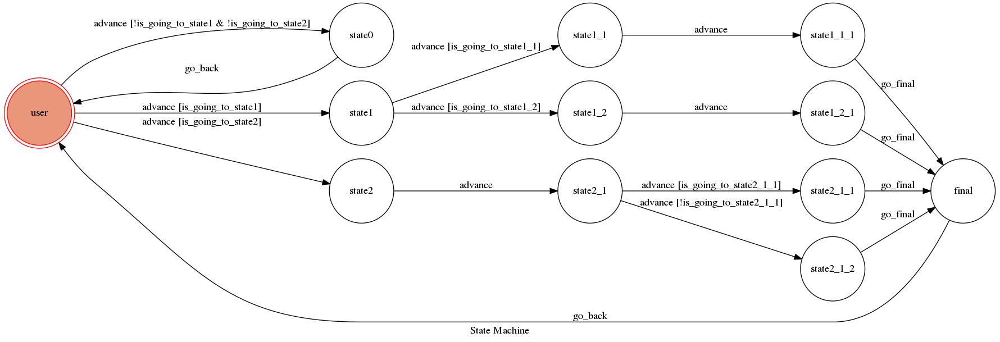

# YBOTF

Your BOT Friend - 你的機器人好朋友

他可以做什麼：
* 聊八卦
* 聊電影
* 聊音樂
* 聊星座
* 抽卡

試著了解他並獲得他的好感度！

## 設定

### 用到的環境

* Python 3
* Facebook Page and App
* HTTPS Server

#### 安裝需要用到的套件

```sh
pip3 install -r requirements.txt
```

#### 環境變數設定

需要先設定 `VERIFY_TOKEN` 和 `ACCESS_TOKEN`

#### 執行本地伺服器

```sh
./ngrok http 5000
python3 app.py
```

## Finite State Machine


## 程式流程及介紹

### 目標

* 在與他聊天的過程中獲得機器人足夠的好感度

### 流程及功能：

* 開始：'user'
	* 問候他 ex."你好"，"嗨"
	* 輸入：抽
		* 回應：（圖片）
	* 問他幹話 ex."台灣哪個姓氏最帥"（可參考文本Gossiping-QA-Dataset.txt）
	* 問他可以幹嘛 ex."你可以幹嘛"
		* 回應：（提示你可以問他什麼）
	* 問他喜歡什麼
		* 前往state1
	* 問他星座
		* 前往state2
* 興趣：'state1'
	* 猜他的興趣
		* 猜錯：給不同的提示，好感度-1
		* 猜電影：告訴你他喜歡的電影和連結（隨機），好感度+2，前往state1_1
		* 猜音樂：好感度+2，前往state1_2
* 電影：'state1_1'
	* 輸入：（片名 ex. "比悲傷更悲傷的故事"）（可參考yahoo奇摩電影台北票房排行榜）
		* 前往state1_1_1
		* 電影在台北票房排行榜裡：告訴你該電影介紹的連結，好感度+1，前往final state
		* 電影不在排行榜裡：隨機推薦一部電影和連結，前往final state
* 音樂：'state1_2'
	* 問他歌手 ex. "你喜歡盧廣仲嗎"（可參考文本q&a1_2.txt）
		* 前往state1_2_1
		* 他認識這位歌手：回覆某一段歌詞，好感度+1，前往final state
		* 不認識：前往final state
* 星座：'state2'
	* 猜他的星座
		* 猜對（雙魚）：好感度+3，前往state2_1
		* 猜其他星座：告訴你該星座的特徵（隨機）
	* 輸入：提示
		* 給你提示（隨機）
* 星座特徵：'state2_1'
	* 猜雙魚座的特徵（可參考文本q&a2.txt）
		* 猜對：前往state2_1_1，好感度+5，前往final state
		* 猜錯：前往state2_1_2，回復你該特徵可能的星座，好感度-2，前往final state
* 結果：'final'
	* 結算好感度分數
		* 分數 >= 10：恭喜你基本上已經認識他的全部，分數歸零
		* 分數 < 0：他很生氣，分數歸零
		* 不足10分：試著獲得他的好感
		
### 使用到的演算法及工具

* ptt爬蟲
	* 爬取ptt表特版文章裡的圖片url
	* 抽卡功能
	* 傳送圖片
* yahoo電影排行榜爬蟲
	* 爬取網頁的電影名稱和連結
	* 隨機答覆及推薦某一部電影的功能
	* 判斷電影名稱是否在排行榜的功能
* Okapi bm25算法
	* 計算輸入文字與問答語料庫文檔的相關程度，找出最符合搜索詞的問句及其對應的答覆
	* 用於程式中的問答功能：問候語、聊八卦、歌手和對應歌詞、星座和其對應的特徵
	* 使用jieba分詞工具處理文檔

### 其他資源使用
* ptt表特版網頁
* yahoo電影排行版網頁
* ptt八卦版問答語料
* 網路上星座分析文章
